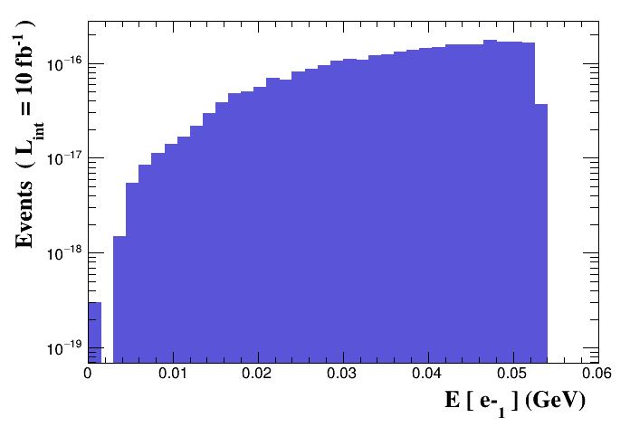

# Exercise 3

Calculate the width of the muon. Plot the energy spectrum of the
electron.

## Results

To obtain the following results, `cd` in the current directory and run:

```bash
mg5_aMC ex1_3.mg5
```

The `mu- > e- ve~ vm` cross section is:

```text
xsec = 3.016e-19 +/- 6e-22 pb
```

The [madanalysis pdf](tag_1_MA5_parton_analysis_analysis1.pdf) file stores the
output plots for the requested process.  
In particular the electron energy spectrum:

