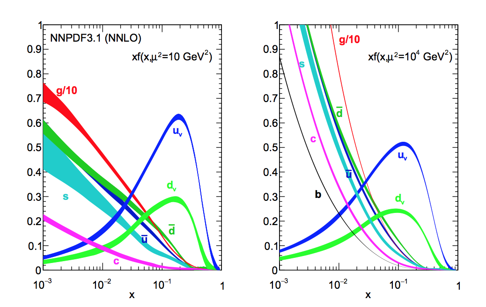

# Exercise 5

ttbar production at hadron collider.

## Part (a)

Find the LO cross sections for ttbar production at Tevatron and LHC. At LO there are two production channels: qqbar and gg.

To obtain the following results, `cd` in the current directory and run:

```bash
mg5_aMC mg5_ex1_5a.dat
```

- Tevatron  
  Center of mass energy: 1 TeV.  
  `p p > t t~` cross section is `0.02229 +\- 4.6e-05 pb`  
  The qqbar channel contributes for 77% of the total cross section.
- LHC  
  Center of mass energy: 13 TeV (Run 2).  
  `p p > t t~` cross section is `504.2 +\- 0.7 pb`  
  The gg production channel is the dominant one, accounting for 87% of the total cross section.

The predominance of one of the two channels is given by the internal structure of the proton, described by the pdfs, as in the image below.

- Low energy: valence quarks provide the major contribution.
- High energy: the pdfs are dominated by gluons, mainly at small parton energy fraction `x` and high energy scale `Q^2` (right panel below uses the factorization scale `mu^2`).

<div style="text-align:center"></div>

## Part (b)

Find the cross sections for `p p > t t~ j` production at the LHC. Select events for which the jet has `pT > 20 GeV` and `|eta| < 4`.

The jet rapidity (hence `delta R`) cut is needed in order to have a IR safe observable: when a gluon is emitted collinearly to a top, then a singularity arises.  
A cut is imposed by default in the madgraph run card, reflecting the fact that an infinite angular resolution cannot be achieved by any experiment.

To obtain the following results, `cd` in the current directory and run:

```bash
mg5_aMC mg5_ex1_5b.dat
```

The `p p > t t~ j` cross section is:

```text
xsec = 547.1 +\- 2 pb
```

This value is higher than the one for `p p > t t~` at LO computed before. This is due to the opening of the qg production channel, when considering the 1-jet production. The `q g > t t~ j` diagrams are displayed [here](qg_diagrams.pdf).
