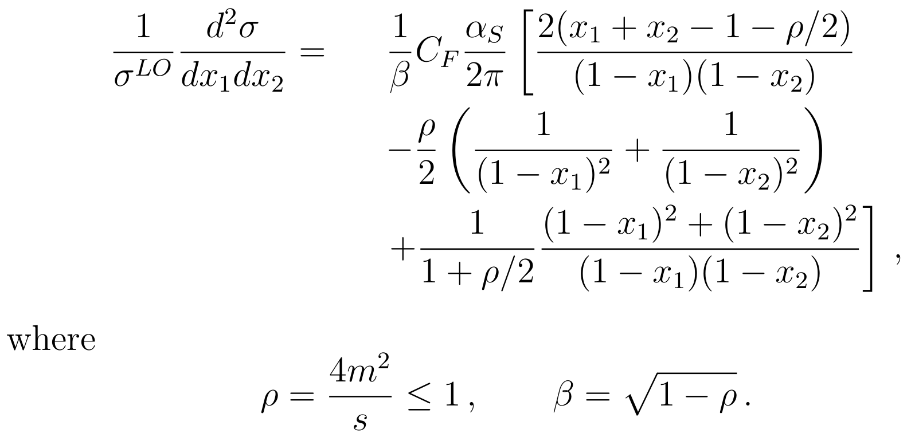
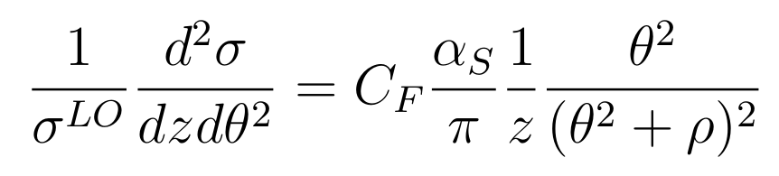
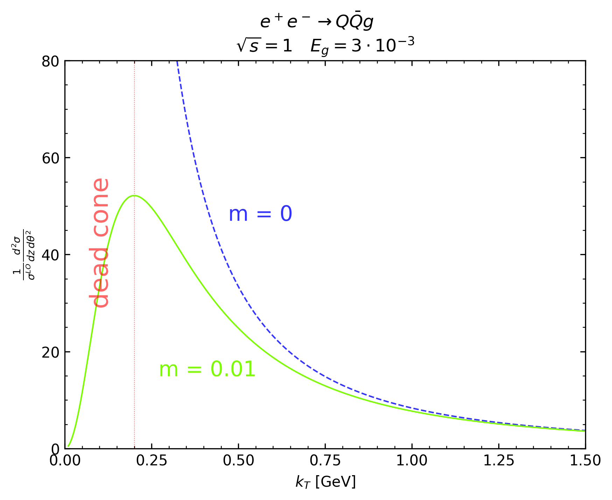

# Exercise 1a

The differential cross section of `e+ e- > q qbar g` for the case of massive
final state is:

<div style="text-align:center"></div>

while in the massless and collinear gluon emission case, it becomes:

<div style="text-align:center"></div>
<!--the massless image width is 54% the massive one)-->

where `z = \frac{2 E_g}{\sqrt{s}}`, `E_g` and `\theta` are gluon energy and
angle with the quark respectively.

Plot the behaviour of the matrix element in the soft and collinear limit as a
function of the gluon transverse momentum, for the massless and massive cases.

To obtain the following results, `cd` in the current directory and run:

```bash
python plotME.py
```

The following figure is stored in the [me(kt).png](me(kt).png) file.

<div style="text-align:center"></div>

The dead cone in the figure is the verical stripe for `k_T < 2m`.
