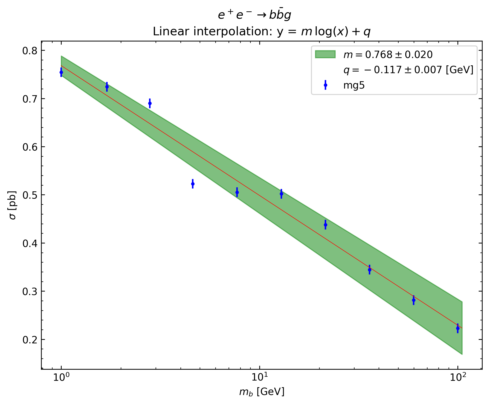

# Exercise 1c

Verify that the differential cross section of `e+ e- > q qbar g` contains no
collinear divergencies to be regulated.  
The cross section is finite with just a minimum cut on the gluon energy `E_g`.

Plot the cross section as a function of the quark mass and verify that it has a
logarithmic behaviour.

## Results

To obtain the following results, `cd` in the current directory and run:

```bash
mg5_aMC ex2_1c.mg5
```

The script will output the
[cross_section_eex_bbxg_Egmin0.01.txt](cross_section_eex_bbxg_Egmin0.01.txt)
file containing a short description of the runs and the correspondent cross
sections.

Run the following command to plot the cross section as a function of the `b`
quark mass:

```bash
python plot_xsec.py
```

This produces the following image:

<div style="text-align:center">

</div>

The cross section varies logarithmically with the `b` quark mass: the logarithmic
scale on the x axis shows that a straight line interpolates well the given points
