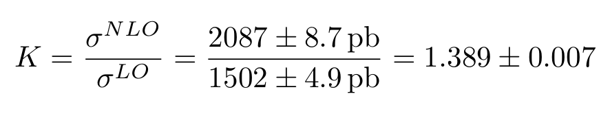

# Exercise 2

Calculate the cross section for `e+ e- > q q~` at NLO. Compute the K-factor.

## Results

To obtain the following results, `cd` in the current directory and run:

```bash
mg5_aMC ex2_2.mg5
```

- `e+ e- > q q~` at LO cross section is: `0.5314 +\- 0.0033 pb`
- `e+ e- > q q~` at NLO cross section is: `0.546 +\- 0.0019 pb`

The K-factor is the ratio between NLO and LO results:

<div style="text-align:center">

</div>
