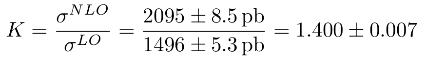

# Exercise 3

Calculate the cross section for `p p > e+ e-` at NLO. Compute the K-factor.  
Comment and explain the differences between LO and NLO distributions.

## Results

### K factor

To obtain the following results, `cd` in the current directory and run:

```bash
mg5_aMC ex2_3.mg5
```

- `p p > e+ e-` at LO cross section is: `1496 +\- 5.3 pb`
- `p p > e+ e-` at NLO cross section is: `2095 +\- 8.5 pb`

The K-factor is the ratio between NLO and LO results:

<div style="text-align:center">

</div>

### Histogram distribution

Histrogram distributions are plotted in [LO_histograms.pdf](LO_histograms.pdf)
and [NLO_histograms.pdf](NLO_histograms.pdf).

Note: several histogram distributions are trivial at the LO due to energy conservation.  
Examples of such variables are transverse momentum and rapidity of the
intermediate vector boson (photon or Z), or also the combined azimuth angle of
the lepton pair in the final state.  
At NLO, instead, extra parton radiation leads to non-trivial behaviors of such
variables.
