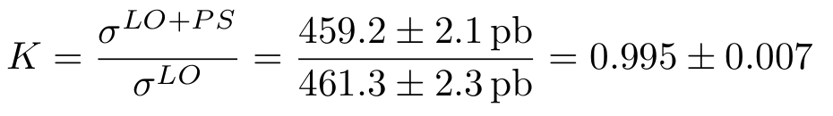
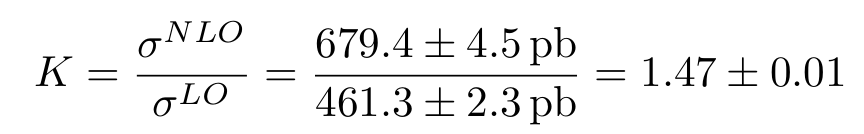
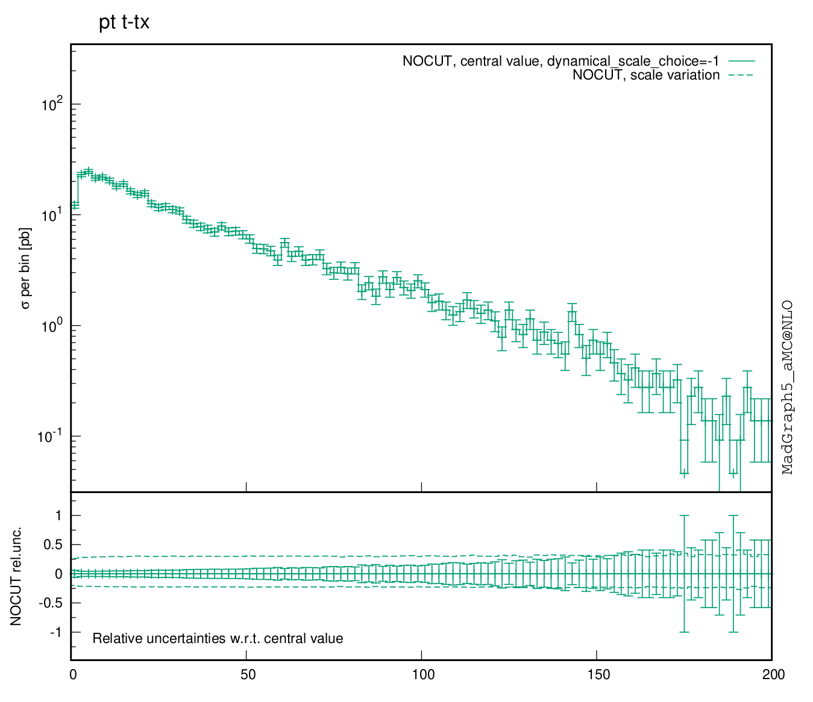
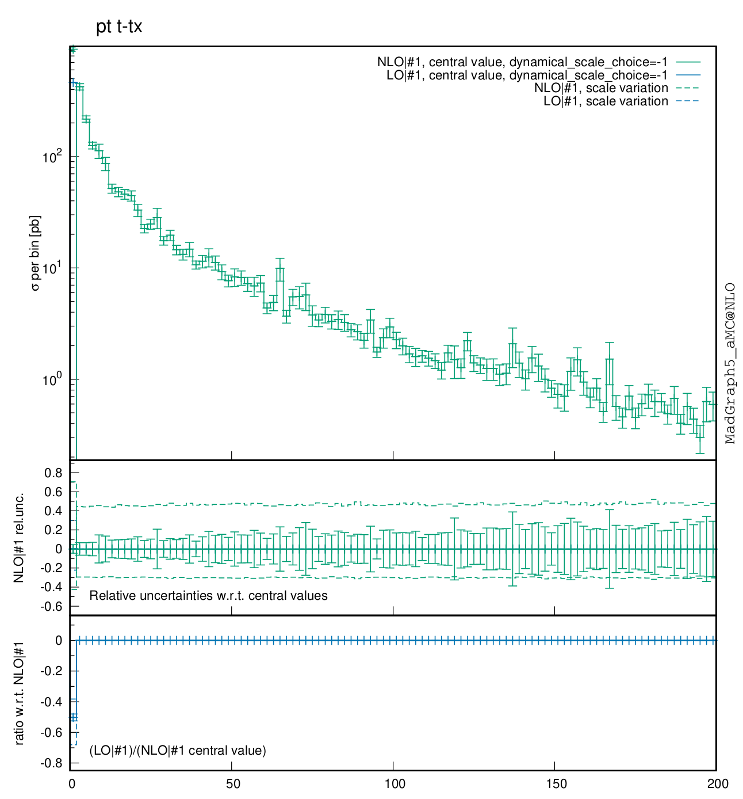

# Exercise 4

Calculate the cross section for `p p > t t~` at LO, LO+PS and NLO. Compute the
K-factor.  
Comment the differences between the distributions.

## Results

To obtain the following results, `cd` in the current directory and run:

```bash
mg5_aMC ex2_4.mg5
```

- `p p > t t~` at LO cross section is: `461.3 +\- 2.3 pb`
- `p p > t t~` at LO+PS cross section is: `459.2 +\- 2.1 pb`
- `p p > t t~` at NLO cross section is: `679.4 +\- 4.5 pb`

The K-factor is the ratio between LO+PS and LO results:

<div style="text-align:center">

</div>

Note: the K factor is consistent with 1. LO and LO+PS, indeed, should have the same inclusive cross section.

The K-factor is the ratio between NLO and LO results:

<div style="text-align:center">

</div>

The histogram distributions are stored in
[LO_histograms.pdf](LO_histograms.pdf),
[plot_PYTHIA6Q_1_0.pdf](plot_PYTHIA6Q_1_0.pdf) and
[NLO_histograms.pdf](NLO_histograms.pdf) for LO, LO+PS and NLO respectively.

Some observables are trivial in the LO computation, like in the the case of the
`t t~` pair `pT` distribution.
Attaching the shower to the LO hard process, as well as considering the NLO
computation, the radiation from all the legs is taken into account. This leads
to the non-trivial profiles shown by the `pT` distributions.

The LO+PS `pT` distribution:

<div style="text-align:center">

</div>

The distribution has an heavy tail on the right.

The NLO `pT` distribution:

<div style="text-align:center">

</div>

The distribution is peaked at zero due to a collinear divergence. Attaching the
parton shower to the NLO fixed order computation and taking care of the ME+PS
matching to avoid double counting, it could be possible to obtain a distribution
resummed to all orders in the coupling costant.
