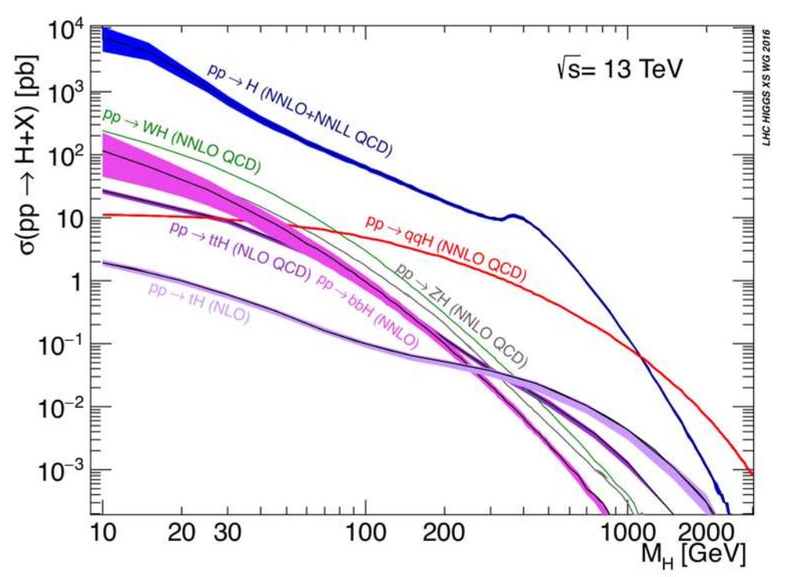

# Exercise 5

Obtain the cross section at LO (NLO if possible) for the main Higgs
(`m_H = 125GeV`) production channels at the LHC.  
Compare with the following plot:

<div style="text-align:center">

</div>

## Results

To obtain the following results, `cd` in the current directory and run:

```bash
mg5_aMC ex2_5.mg5
```

The script executes the code in [extra_VBF_cmd.sh](extra_VBF_cmd.sh).

The Higgs production channels with the correspondent cross sections are listed
below:

<center>

| Name | Process | Cross Section |
| --- | --- | --- |
| gluon fusion (GF) | `p p > H` | `32.9 +/- 0.2 pb` |
| vector boson fusion (VBF) | `p p > q q H` | `3.562 +/- 0.024 pb` |
| W associate production | `p p > W H` | `0.3115 +/- 0.0007 pb` |
| Z associate production | `p p > Z H` | `0.050750 +/- 0.00007 pb` |
| tt-pair | `p p > t t~ H` | `0.4624 +/- 0.0015 pb` |
| single-top | `p p > t H` | `0.0693 +/- 0.0006 pb` |

</center>