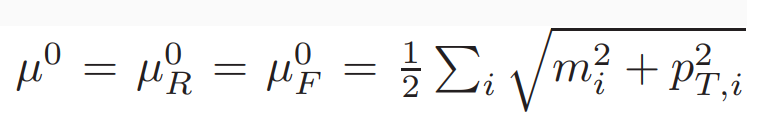
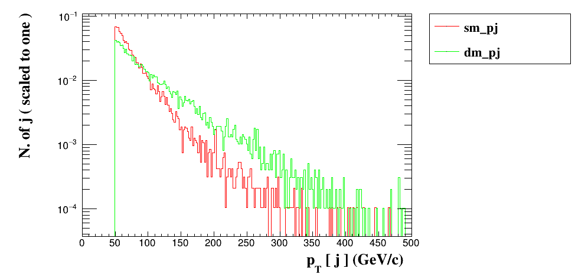
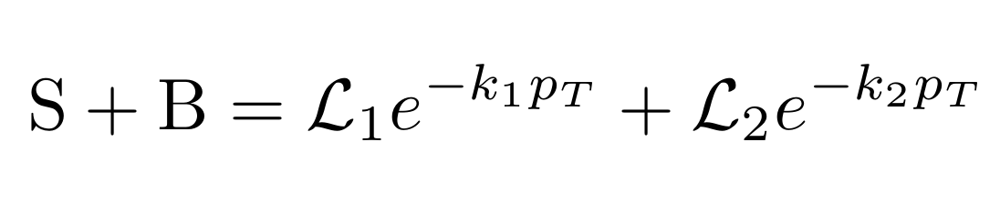
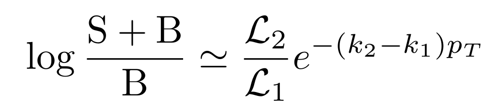
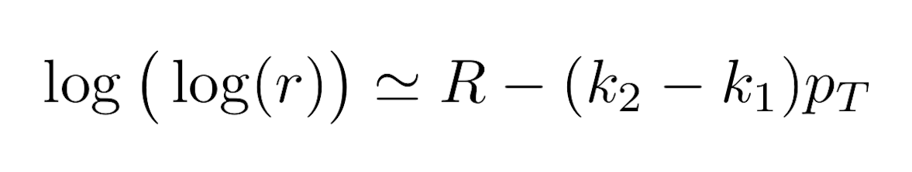
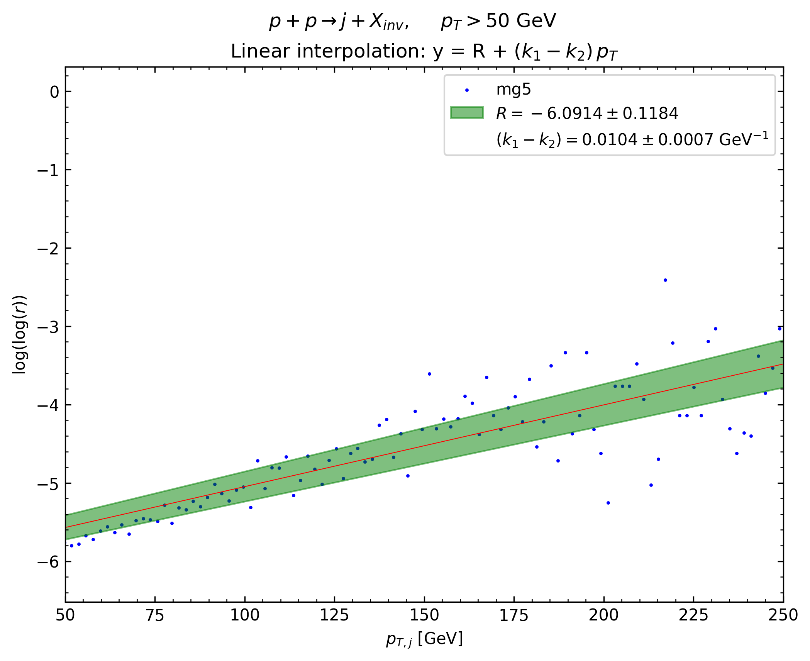
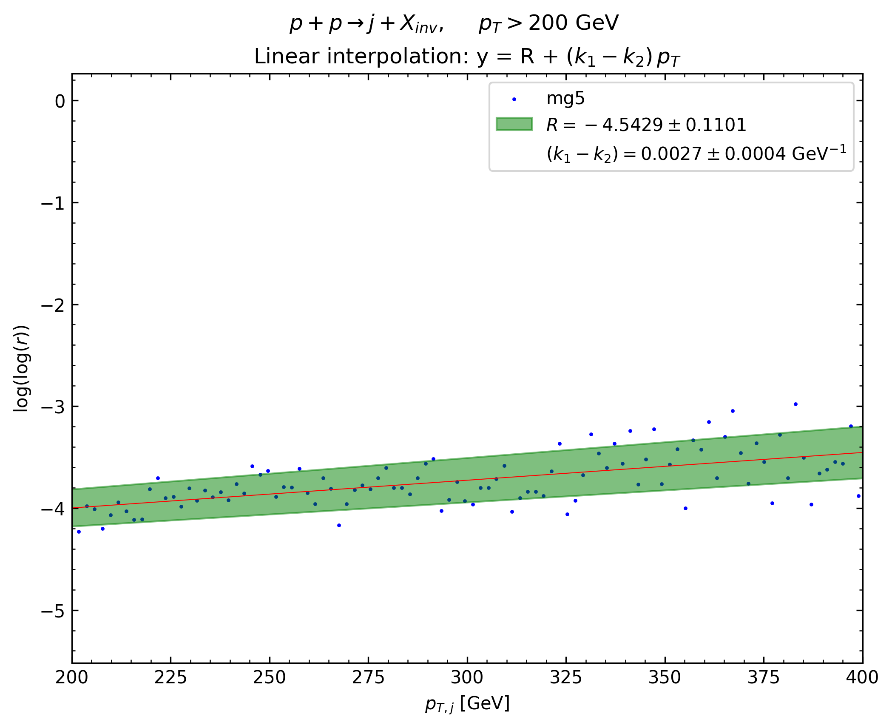

# Day 3

Consider a simplified DM model, with a scalar s-channel mediator `y0` and DM
candidate among those (`xr`, `xc`, `xd`) in `DMsimp_s_spin0`.  

- Identify a signature of your interest.  
- Calculate the signal cross section at LO.  
- Identify the main SM irreducible backgrounds.  
- Try to design a simple analysis to select the signal over the backgrounds using
`MA5`.

## Importing a model

In `MG5_aMC@NLO` the user can undesrtand how to download and import a UFO
(Universal FeynRules Output) model directly from the `MG5` interface with:

```text
> import help
```

The database of registered UFO models are listed and downloadable at this
[link](https://feynrules.irmp.ucl.ac.be/wiki/ModelDatabaseMainPage), or again
through the `MG5` interface with:

```text
> display modellist
> import model MODEL
```

The model can be inspected through the `display` command like the following:

```text
> display particles [PARTICLE]
> display interactions
```

The output of such commands can be fully understood reading this reference paper
[arXiv:1108.2040.pdf](https://arxiv.org/pdf/1108.2040.pdf).  

## Results

To obtain the following results, `cd` in the current directory and run:

```bash
mg5_aMC ex3.mg5
```

Note: we follow the analysis benchmark described in
[arXiv:1508.00564.pdf](https://arxiv.org/pdf/1508.00564.pdf). In particular, the
"resonant" benchmark.

## Resonant benchmark and technical setup

The model is tested in the resonant production of the mediator `y0` and its decay
into a pair of DM particles.

In this benchmark, the masses of the mediator `y0` and dark matter particle `xr`
are set to `200` and `50 GeV` respectively.

We consider the scalar interaction only, namely the processes containing the
`y0 > xr xr` only

The parton distribution function set used is the MSTW2008lo90cl (`lhaid = 21050`).  
Factorization and renormalization scales are set to the half sum of the transverse
mass of the final state particles:

<div style="text-align:center">

</div>

The collider energy is set to the default value of `13 TeV`.  
The computation is performed within the 5-flavor scheme.

## Mono-jets process

Let the signature of interest be a process with a final state of `j + inv`.

There is just one irreducible `SM` background process: `p p > j vl vl~`.  
The correspondent SM Feynman diagrams are plotted [here](plots/sm/README.md).

Regarding the `BSM` physics, the present benchmark focuses on the following signal
process: `p p > j xd xd~`.  
The `Y0` mediator interacts with the DM candidate field `xd` through a pure scalar Yukawa interaction.  
The `BSM` diagrams are plotted [here](plots/bsm/README.md).

## Analysis

The cross section values are displayed in the following table for different cuts
on the jet `pT` (for all the processes, the jet `pT` directly constrains the
`pT` of the invisibles, as a consequence of energy conservation):

|Jet `pT` cut| `50 GeV`| `200 GeV` |
| --- | --- | --- |
| `p p > j vl vl~`  | `648.7 +\- 2.2` | `10.570 +\- 0.036` |
| `p p > j xd xd~` | `3.203 +\- 0.012` | `0.2210 +\- 0.0006`|

Folder [systematics](systematics) contains the theoretical scales and the PDFs uncertainties.

Folder [ma5](ma5) instead contains the `MadAnalysis5` output files produced with
the [madanalysis.mg5](madanalysis.mg5) script file.

In particular, it is interesting to focus on the `pT` histogram. An example (jet
`pT` cut is `50 GeV`) in the following picture:

<div style="text-align:center">

</div>

The green and red shapes represent the signal and background normalized
histograms, respectively. It is clear that both cross sections depend
exponentially on the jet transverse momentum (which, for this process, equals the missing transverse energy), but with different decaying constant (the negative
slope in the log-scaled plot).

Given enough statistics, then, it could be possible to define a quantity to look
for new physics.

The idea is that a dataset of events containing a signal of new physics on top
of the SM background should look like this:

<div style="text-align:center">

</div>

where the `L`s are the integrated luminosities that normalize the processes, the
`k`s are the exponential slopes. Subscripts `1` stands for the BSM processes (signal),
while `2` for the SM ones (background).

Taking the logarithm of both sides and collecting the background factor in the
sum, it is possible to compute an approximate expression for the logarithm of the signal to background ratio `r`:

<div style="text-align:center">

</div>

the approximation holds as long as the ratio `L2/L1 << 1`. This is in fact the
case, since the luminosities are inversely proportional to the cross section and
the SM cross sections is at least `47.8x` larger than the BSM one (jet `pT` cut
equal to `50 GeV`).

As a consequence, the double logarithm of the signal to background ratio `r`
depends linearly with the jet transverse momentum:

<div style="text-align:center">

</div>

Therefore, restricting the discussion to the bulk of the distribution to avoid
`NaN`s in the computation of the logarithms, the angular coefficient `delta K` can
be fitted.  
If the result turns out to deviate from zero, the dataset contains the
aforementioned BSM physics.

## Analysis Results

The following commands run the analysis:

```bash
python plot_log2r_pt.py 
python plot_log2r_pt.py
```

- Jet `pT` cut: 50 GeV. `delta K = (10.3 +- 0.7) * 1e-3 GeV^-1`.

<div style="text-align:center">

</div>

- Jet `pT` cut: 200 GeV. `delta K = (2.9 +- 0.4) * 1e-3 GeV^-1`.

<div style="text-align:center">

</div>

Both the angular coefficients deviate from zero. The effect is more prominent
in the first case.  
