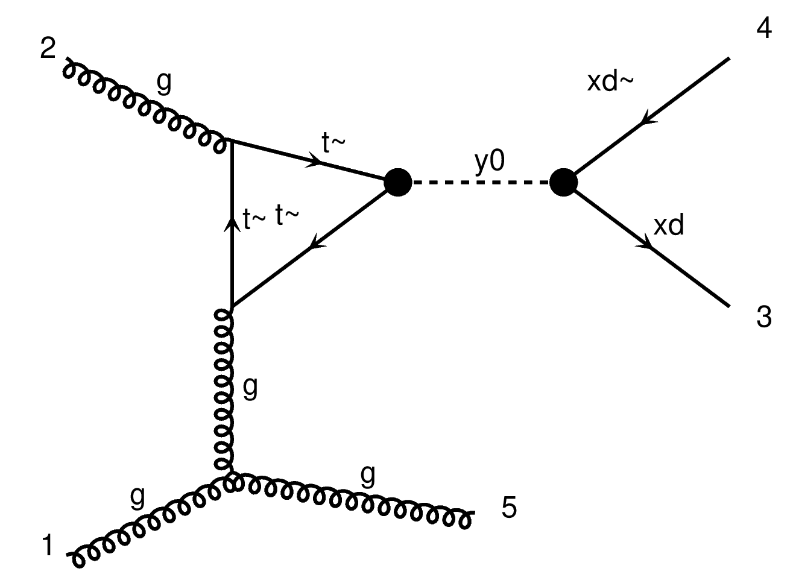

# BSM process: `p p > j + xd xd~`

The LO Feynman diagrams contributing in this process start with a top loop
induced process. The reason is that the only fermion coupling with the dark
matter mediator `y0` is the top.

There are three main subprocesses with 6 type of diagrams:

- `q q > g xd xd~`

 g xd xd~" width=40%/>

- `q g > g xd xd~`

 g xd xd~" width=40%/>

- `g g > g xd xd~`

|  |  |
| --- | ---|
| s channel, diagram 1 | s channel, diagram 2 |

|  |  |
| --- | ---|
| s channel, diagram 3 | t channel|
